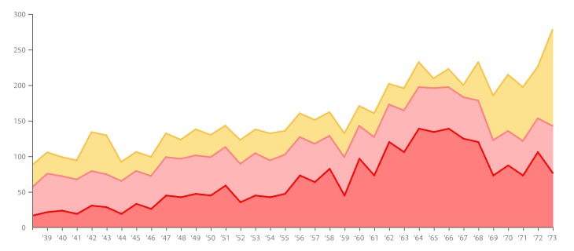

## ¿Por qué graficar?

Es importante que podamos traducir los datos que nos arrojan nuestro programa en un elemento visual, así podemos realizar reconocimientos de patrones, predicción de series, simplifica la interpretación y la conclusión acerca de los datos.

 
  

