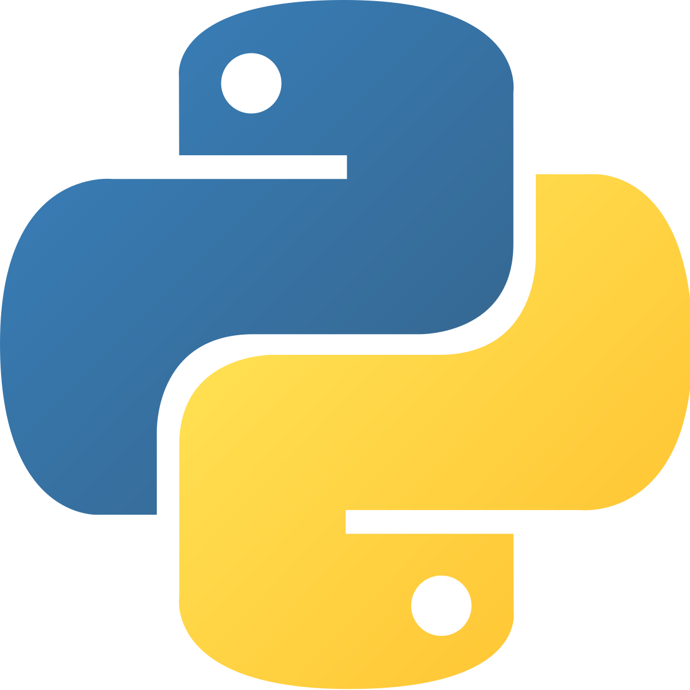

  <h1>Programación orientada a objetos y Algoritmos con Python</h1>

 
  

# Introducción 

El contenido de este repositorio esta basado en el curso del mismo nombre dictado por [David Aroesti](https://Twitter.com/jdaroesti) en [Platzi](https://platzi.com/r/EliazBobadilla).Si es que usted es nuevo en Python talvez deberia empezar por [este curso](https://platzi.com/clases/python), o tambien por [este otro](https://platzi.com/clases/python-2019/) del mismo profesor de este curso.
## Tabla de contenido
- [Programación Orientada a Objetos](./Notas/01|ProgramaciónOrientadaAObjetos/)
    - [Objetivos](#objetivos)
    - [Clases en Python](./Notas/01|ProgramaciónOrientadaAObjetos/02_Clases.md)
    - [Instancias en Python](./Notas/01|ProgramaciónOrientadaAObjetos/03_Instancias.md)
    - [Atributos de las Instancias](./Notas/01|ProgramaciónOrientadaAObjetos/04_AtributosDeLaInstancia.md)
    - [Metodos de las Instancias](./Notas/01|ProgramaciónOrientadaAObjetos/05_MetodosDeInstancia.md)
    - [Datos Abstractos](./Notas/01|ProgramaciónOrientadaAObjetos/06_DatosAbstractos.md)
    - [Instancias](./Notas/01|ProgramaciónOrientadaAObjetos/07_Instancias.md)
    - [Decomposició0n](./Notas/01|ProgramaciónOrientadaAObjetos/08_Descomposicion.md)
    - [Abstracción](./Notas/01|ProgramaciónOrientadaAObjetos/09_Abstracción.md)
    - [Encapsulación, getters and setters](./Notas/01|ProgramaciónOrientadaAObjetos/10_EncapsulaciónGettersAndSetters.md)
    - [Herencia](./Notas/01|ProgramaciónOrientadaAObjetos/11_Herencia.md)
    - [Polimorfismo](./Notas/01|ProgramaciónOrientadaAObjetos/12_Polimorfismo.md)
- [Complejidad algorítmica](./Notas/02|ComplejidadAlgoritmica)
    - [Introducción a la complejidad algorítmica](./Notas/02|Complejidad algorítmica/Introducción-a-la-complejidad-algorítmica)
    - [Medición temporal](./Notas/02|Complejidad algorítmica/Medición-temporal)
    - [Conteo abstracto de operación](./Notas/02|Complejidad algorítmica/Conteo-abstracto-de-operación)
    - [Notación asintótica](./Notas/02|Complejidad algorítmica/Notación-asintótica)
    - [Clases de complejidad algorítmica](./Notas/02|Complejidad algorítmica/Clases-de-complejidad-algorítmica)
- [Algoritmos de búsqueda y ordenación](#Algoritmos-de-búsqueda-y-ordenación)
    - [Búsqueda lineal](#Búsqueda-lineal)
    - [Búsqueda binaria](#Búsqueda-binaria)
    - [Ordenamiento de burbuja](#Ordenamiento-de-burbuja)
    - [Ordenamiento por inserción](#Ordenamiento-por-inserción)
    - [Ordenamiento por mezcla](#Ordenamiento-por-mezcla)
- [Ambientes virtuales](#Ambientes-virtuales)
- [Graficado](#Graficado)
    - [¿Por qué graficar?](#¿Por-qué-graficar?)
    - [Graficado simple](#Graficado-simple)
- [Algoritmos de optimización](#Algoritmos-de-optimización)
    - [Introducción a la optimización](#Introducción-a-la-optimización)
    - [El problema del morral](#El-problema-del-morral)

## Objetivos
Con este repositorio tengo como **objetivos:**
- Entender cómo funciona la Programación Orientada a Objetos.
- Entender cómo medir la eficiencia temporal y espacial de nuestros algoritmos.
- Entender cómo y por qué graficar.
- Aprender a resolver problemas de búsqueda, ordenación y optimización.