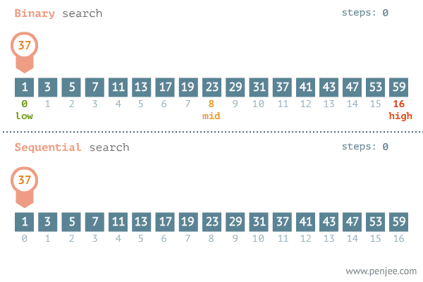

<div align="center">
  <h1>Programación orientada a objetos y Algoritmos con Python</h1>
</div>

<div align="center"> 
  
</div>

# Introducción al documento

El contenido de este documento esta basado en el curso del mismo nombre dictado por [David Aroesti](https://github.com/jdaroesti) en [Platzi](https://platzi.com/r/EliazBobadilla).
# Tabla de contenido
- [Programación Orientada a Objetos](#Programación-Orientada-a-Objetos)
    - [Objetivos](#Objetivos)
    - [Programación orientada a objetos en Python](#Programación-orientada-a-objetos-en-Python)
    - [Tipos de datos abstractos y clases, Instancias](#Tipos-de-datos-abstractos-y-clases,-Instancias)
    - [Decomposición](#Decomposición)
    - [Abstracción](#Abstracción)
    - [Encapsulación, getters and setters](#Encapsulación,-getters-and-setters)
    - [Herencia](#Herencia)
    - [Polimorfismo](#Polimorfismo)
- [Complejidad algorítmica](#Complejidad-algorítmica)
    - [Introducción a la complejidad algorítmica](#Introducción-a-la-complejidad-algorítmica)
    - [Medición temporal](#Medición-temporal)
    - [Conteo abstracto de operación](#Conteo-abstracto-de-operación)
    - [Notación asintótica](#Notación-asintótica)
    - [Clases de complejidad algorítmica](#Clases-de-complejidad-algorítmica)
- [Algoritmos de búsqueda y ordenación](#Algoritmos-de-búsqueda-y-ordenación)
    - [Búsqueda lineal](#Búsqueda-lineal)
    - [Búsqueda binaria](#Búsqueda-binaria)
    - [Ordenamiento de burbuja](#Ordenamiento-de-burbuja)
    - [Ordenamiento por inserción](#Ordenamiento-por-inserción)
    - [Ordenamiento por mezcla](#Ordenamiento-por-mezcla)
- [Ambientes virtuales](#Ambientes-virtuales)
- [Graficado](#Graficado)
    - [¿Por qué graficar?](#¿Por-qué-graficar?)
    - [Graficado simple](#Graficado-simple)
- [Algoritmos de optimización](#Algoritmos-de-optimización)
    - [Introducción a la optimización](#Introducción-a-la-optimización)
    - [El problema del morral](#El-problema-del-morral)

# Programación Orientada a Objetos

## Objetivos

Con este documento tenemos como **objetivos:**

- Entender cómo funciona la Programación Orientada a Objetos.
- Entender cómo medir la eficiencia temporal y espacial de nuestros algoritmos.
- Entender cómo y por qué graficar.
- Aprender a resolver problemas de búsqueda, ordenación y optimización.


## Conteo abstracto de operación

Con esta técnica contamos los pasos que realiza nuestro algoritmo. En el siguiente ejemplo `respuesta` tendrá los números de pasos que realiza nuestro código al ejecutar.

```py
def f(x):

    respuesta = 0

    for i in range(1000):
        respuesta += 1

    for i in range(x):
        respuesta += x

    for i in range(x):
        for j in range(x):
            respuesta += 1
            respuesta += 1

    return respuesta
```

## Notación asintótica

Cuando hablamos de **notación asintótica** no importan las variaciones pequeñas, el enfoque se centra en lo que pasa conforme el tamaño del problema se acerca al infinito.

Siempre tenemos que estar preparados para cualquier caso, por lo que tenemos que saber medir a nuestro algoritmo en el mejor, promedio y peor de los casos.

Lo mejor que nos permite comparar nuestros algoritmos y su capacidad es medir el peor de los casos, ahí es donde entra el **Big O notation**, donde lo único que importa es el termino de mayor tamaño, sin importar las constantes que las acompañan. 

```py
# Ley de la suma

def f(n):
    for i in range(n):
        print(i)

    for i in range(n):
        print(i)

# En este caso el mayor término es n
# O(n) + O(n) = O(n + n) = O(2n) = O(n)
```

```py
# Ley de la suma

def f(n):
    for i in range(n):
        print(i)

    for i in range(n * n):
        print(i)

# En este caso el mayor término es n²
# O(n) + O(n * n) = O(n + n²) = O(n²)
```

```py
# Ley de la multiplicación

def f(n):

    for i in range(n):

        for i in range(n):
            print(i, j)

# En este caso el mayor término es n²
# O(n) + O(n * n) = O(n * n) = O(n²)
```

```py
# Recursividad múltiple

def fibonacci(n):

    if n == 0 or n == 1:
        return 1

    return fibonacci(n - 1) +  fibonacci(n - 2)

# En este caso el mayor término es 2**n (el símbolo ** denota "elevado a"),
# ya que realiza recursividad 2 veces por n veces.
# O(2**n)
```

## Clases de complejidad algorítmica

Existen distintos tipos de complejidad algorítmica:

- **O(1) Constante:** no importa la cantidad de input que reciba, siempre demorara el **mismo tiempo**.
- **O(n) Lineal:** la complejidad crecerá de forma **proporcional** a medida que crezca el input.
- **O(log n) Logarítmica:** nuestra función crecerá de forma **logarítmica** con respecto al input. Esto significa que en un inicio crecerá rápido, pero luego se estabilizara.
- **O(n log n) Log lineal:** crecerá de forma **logarítmica** pero junto con una **constante**.
- **O(n²) Polinomial:** crecen de forma cuadrática. No son recomendables a menos que el input de datos en pequeño.
- **O(2^n) Exponencial:** crecerá de forma **exponencial**, por lo que la carga es muy alta. Para nada recomendable en ningún caso, solo para análisis conceptual.
- **O(n!) Factorial:** crece de forma **factorial**, por lo que al igual que el exponencial su carga es muy alta, por lo que jamas utilizar algoritmos de este tipo.

<div align="center"> 
  
</div>

# Algoritmos de búsqueda y ordenación

## Búsqueda lineal

La **búsqueda lineal** es un algoritmo muy sencillo. Consta en buscar si un elemento se encuentra dentro de una lista, array o un sistema ordenado o no ordenado para poder determinar si el elemento se encuentra en el o forma parte de el.

¿Cuál es el peor caso del siguiente código? Si nos fijamos existe un **for loop** que crece según el tamaño de la lista, por lo cual nuestro Big O es O(n).

```py
import random

def busqueda_lineal(lista, objetivo):
    match = False

    for elemento in lista: # O(n)
        if elemento == objetivo:
            match = True
            break

    return match


if __name__ == '__main__':
    tamano_de_lista = int(input('De que tamano sera la lista? '))
    objetivo = int(input('Que numero quieres encontrar? '))

    lista = [random.randint(0, 100) for i in range(tamano_de_lista)]

    encontrado = busqueda_lineal(lista, objetivo)
    print(lista)
    print(f'El elemento {objetivo} {"esta" if encontrado else "no esta"} en la lista')
```

## Búsqueda binaria

La **búsqueda binaria** toma una estrategia llamada "Divide y conquista", la cual consiste en dividir el problema en 2 en cada iteración. Este algoritmo asume que la lista se encuentra ordenada, por lo que es necesario realizar este paso primero.

La **búsqueda binaria** es uno de los mejores algoritmos que se tienen hoy en día para búsqueda, ya que reduce significativamente el numero de pasos, y así disminuyendo nuestro Big O.

<div align="center">
  <h4>Caso Promedio</h4>
</div>

<div align="center"> 
  
</div>

<div align="center">
  <h4>Peor de los Casos</h4>
</div>

<div align="center"> 
  
</div>

<div align="center">
  <h4>Mejor de los Casos</h4>
</div>

<div align="center"> 
  
</div>

Para ver de forma practica haremos una búsqueda binaria a través de código. Lo primero que tenemos que realizar es ordenar nuestra lista antes de ejecutar la búsqueda.

```py
import random

def busqueda_binaria(lista, comienzo, final, objetivo):
    print(f'buscando {objetivo} entre {lista[comienzo]} y {lista[final - 1]}')
    if comienzo > final:
        return False

    medio = (comienzo + final) // 2

    if lista[medio] == objetivo:
        return True
    elif lista[medio] < objetivo:
        return busqueda_binaria(lista, medio + 1, final, objetivo)
    else:
        return busqueda_binaria(lista, comienzo, medio - 1, objetivo)


if __name__ == '__main__':
    tamano_de_lista = int(input('De que tamano es la lista? '))
    objetivo = int(input('Que numero quieres encontrar? '))

    lista = sorted([random.randint(0, 100) for i in range(tamano_de_lista)])

    encontrado = busqueda_binaria(lista, 0, len(lista), objetivo)

    print(lista)
    print(f'El elemento {objetivo} {"esta" if encontrado else "no esta"} en la lista')
```

## Ordenamiento de burbuja

El primer algoritmo de ordenamiento que veremos es el **ordenamiento de burbuja**. Es un algoritmo que recorre repetidamente una lista que necesita ordenarse. Compara elementos adyacentes y los intercambia si están en el orden incorrecto. Este procedimiento se repite hasta que no se requiere mas intercambios, lo que indica que la lista se encuentra ordenada.

<div align="center"> 
  
</div>

```py
import random


def ordenamiento_de_burbuja(lista):
    n = len(lista)

    for i in range(n):
        for j in range(0, n - i - 1): # O(n) * O(n) = O(n * n) = O(n**2)

            if lista[j] > lista[j + 1]:
                lista[j], lista[j + 1] = lista[j + 1], lista[j]

    return lista

if __name__ == '__main__':
    tamano_de_lista = int(input('De que tamano sera la lista? '))

    lista = [random.randint(0, 100) for i in range(tamano_de_lista)]
    print(lista)

    lista_ordenada = ordenamiento_de_burbuja(lista)
    print(lista_ordenada)
```

## Ordenamiento por inserción

El ordenamiento por inserción es uno de los algoritmos más comunes que estudian los Científicos del Cómputo. Es intuitivo y fácil de implementar, pero es muy ineficiente para listas de gran tamaño.

Una de las características del ordenamiento por inserción es que ordena en “su lugar.” Es decir, no requiere memoria adicional para realizar el ordenamiento ya que simplemente modifican los valores en memoria.

La definición es simple:

    Una lista es dividida entre una sublista ordenada y otra sublista desordenada. Al principio, la sublista ordenada contiene un solo elemento, por lo que por definición se encuentra ordenada.

    A continuación se evalua el primer elemento dentro la sublista desordenada para que podamos insertarlo en el lugar correcto dentro de la lista ordenada.

    La inserción se realiza al mover todos los elementos mayores al elemento que se está evauluando un lugar a la derecha.

    Continua el proceso hasta que la sublista desordenada quede vacia y, por lo tanto, la lista se encontrará ordenada.

Veamos un ejemplo:

Imagina que tienes la siguiente lista de números:

7, 3, 2, 9, 8

Primero añadimos 7 a la sublista ordenada:

**7**, 3, 2, 9, 8

Ahora vemos el primer elemento de la sublista desordenada y lo guardamos en una variable para mantener el valor. A esa variable la llamaremos `valor_actual`. Verificamos que 3 es menor que 7, por lo que movemos 7 un lugar a la derecha.

**7**, 7, 2, 9, 8 (valor_actual=3)

3 es menor que 7, por lo que insertamos el valor en la primera posición.

**3, 7**, 2, 9, 8

Ahora vemos el número 2. 2 es menor que 7 por lo que lo movemos un espacio a la derecha y hacemos lo mismo con 3.

**3, 3, 7**, 9, 8 (valor_actual=2)

Ahora insertamos 2 en la primera posición.

**2, 3, 7**, 9, 8

9 es más grande que el valor más grande de nuestra sublista ordenada por lo que lo insertamos directamente en su posición.

**2, 3, 7, 9**, 8

El último valor es 8. 9 es más grande que 8 por lo que lo movemos a la derecha:

**2, 3, 7, 9**, 9 (valor_actual=8)

8 es más grande que 7, por lo que procedemos a insertar nuestro valor_actual.

**2, 3, 7, 8, 9**

Ahora la lista se encuentra ordenada y no quedan más elementos en la sublista desordenada.

Antes de ver la implementación en Python, trata de implementarlo por ti mismo y compártenos tu algoritmo en la sección de comentarios.

Esta es una forma de implementar el algoritmo anterior:

```py
def ordenamiento_por_insercion(lista):

    for indice in range(1, len(lista)):
        valor_actual = lista[indice]
        posicion_actual = indice

        while posicion_actual > 0 and lista[posicion_actual - 1] > valor_actual:
            lista[posicion_actual] = lista[posicion_actual - 1]
            posicion_actual -= 1

        lista[posicion_actual] = valor_actual
```

## Ordenamiento por mezcla

El **ordenamiento por mezcla** creado por **John von Neumann** el cual aplica el concepto de "divide y conquista". Primero divide una lista en partes iguales hasta que quedan sublistas de 1 o 0 elementos. Luego las recombina en forma ordenada.

<div align="center"> 
  
</div>

```py
import random

def ordenamiento_por_mezcla(lista):
    if len(lista) > 1:
        medio = len(lista) // 2
        izquierda = lista[:medio]
        derecha = lista[medio:]
        print(izquierda, '*' * 5, derecha)

        # llamada recursiva en cada mitad
        ordenamiento_por_mezcla(izquierda)
        ordenamiento_por_mezcla(derecha)

        # Iteradores para recorrer las dos sublistas
        i = 0
        j = 0
        # Iterador para la lista principal
        k = 0

        while i < len(izquierda) and j < len(derecha):
            if izquierda[i] < derecha[j]:
                lista[k] = izquierda[i]
                i += 1
            else:
                lista[k] = derecha[j]
                j += 1

            k += 1

        while i < len(izquierda):
            lista[k] = izquierda[i]
            i += 1
            k +=1

        while j < len(derecha):
            lista[k] = derecha[j]
            j += 1
            k += 1
        
        print(f'izquierda {izquierda}, derecha {derecha}')
        print(lista)
        print('-' * 50)

    return lista


if __name__ == '__main__':
    tamano_de_lista = int(input('De que tamano sera la lista? '))

    lista = [random.randint(0, 100) for i in range(tamano_de_lista)]
    print(lista)
    print('-' * 20)

    lista_ordenada = ordenamiento_por_mezcla(lista)
    print(lista_ordenada)
```

# Ambientes virtuales

Los **ambientes virtuales** permiten aislar el ambiente para poder instalar diversas versiones de paquetes. A partir de _python 3_ se incluye en la librería estándar en el módulo **venv**. Ningún ingeniero profesional de Python trabaja sin ellos.

**Pip** permite descargar paquetes de terceros para utilizar en nuestro programa, también permite compartir nuestros paquetes con terceros y también podemos definir la versión del paquete que necesitamos.

Para crear un ambiente virtual primer crearemos el directorio para nuestro proyecto.


```bash
mkdir graficado             # Creamos el directorio del proyecto.
cd graficado/               # Ingresamos al directorio.
python3 -m venv env         # Creamos un ambiente virtual en env.
source env/bin/activate     # Activamos el ambiente.
```

Para poder instalar librerías lo haremos con el comando pip.

```bash
pip install bokeh   # pip install instalara la librería.
pip freeze          # Con pip freeze veremos que librerías están instaladas.
```

Para desactivar el ambiente virtual lo haremos con el siguiente comando.

```bash
deactivate          # Comando para desactivar ambiente Virtual
```

# Graficado

## ¿Por qué graficar?

Es importante que podamos traducir los datos que nos arrojan nuestro programa en un elemento visual, así podemos realizar reconocimientos de patrones, predicción de series, simplifica la interpretación y la conclusión acerca de los datos.

<div align="center"> 
  
</div>

## Graficado simple

La librería [**Bokeh**](http://docs.bokeh.org/en/latest/index.html) permite construir gráficas complejas de manera rápida y con comandos simples, también nos permite exportar a varios formatos como html, notebooks, imágenes, etc. [**Bokeh**](http://docs.bokeh.org/en/latest/index.html#) se puede utilizar en el servidor con **Flask** y **Django**.

```py
from bokeh.plotting import figure, output_file, show

if __name__ == '__main__':
    output_file('graficado_simple.html')
    fig = figure()
    
    total_vals = int(input('Cuantos valores quieres graficar?'))
    x_vals = list(range(total_vals))
    y_vals = []

    for x in x_vals:
        val = int(input(f'Valor y para {x}'))
        y_vals.append(val)

    fig.line(x_vals, y_vals, line_width=2)
    show(fig)
```

# Algoritmos de optimización

## Introducción a la optimización

El concepto de **optimización** permite resolver muchos problemas de manera computacional. Cuando pensamos en un algoritmo de optimización debemos definir una función objetivo que debemos maximizar o minimizar, respetando una serie de limitantes que definamos. 

## El problema del morral

<div align="center"> 
  
</div>

Imagina que eres un ladrón que entra a un museo pero tienes un gran problema, nada mas tienes una mochila pero hay muchísimas cosas mas de las que puedes cargar, por lo cual debes determinar cuales artículos puedes cargar y te entregaran el mayor valor posible.

Para este problema sabemos que no podemos dividir los artículos, por lo que nuestra primera aproximación sera evaluar los artículos.

```py
def morral(tamano_morral, pesos, valores, n):

    if n == 0 or tamano_morral == 0:
        return 0

    if pesos[n - 1] > tamano_morral:
        return morral(tamano_morral, pesos, valores, n - 1)

    return max(valores[n - 1] + morral(tamano_morral - pesos[n - 1], pesos, valores, n - 1),
                morral(tamano_morral, pesos, valores, n - 1))


if __name__ == '__main__':
    valores = [60, 100, 120]
    pesos = [10, 20, 30]
    tamano_morral = 40
    n = len(valores)

    resultado = morral(tamano_morral, pesos, valores, n)
    print(resultado)
```
