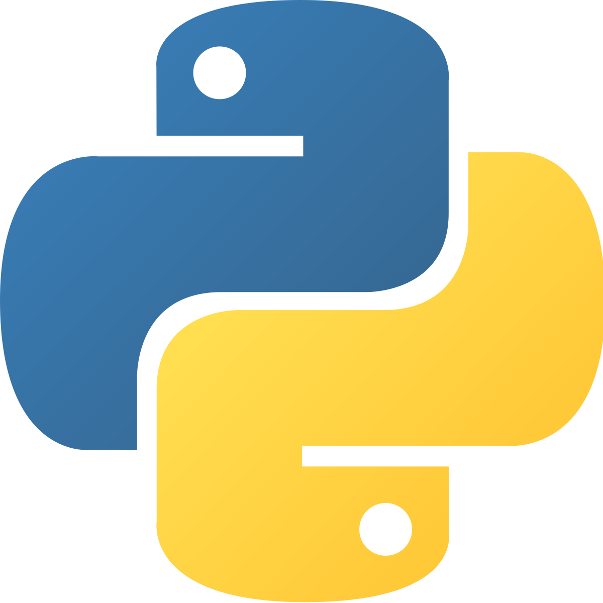

 <h1>Programación orientada a objetos y Algoritmos con Python</h1>

# Introducción:

El contenido de este repositorio esta basado en el curso del mismo nombre dictado por [David Aroesti](https://x.com/jdaroesti) en [Platzi](https://platzi.com/).Si es que usted es nuevo en Python talvez deberia empezar por [este curso](https://platzi.com/clases/python), o tambien por [este otro](https://platzi.com/clases/python-2019/) del mismo profesor de este curso.

## Indice:

- [Programación Orientada a Objetos](./notes/01|ProgramaciónOrientadaAObjetos/)
  - [Objetivos](#objetivos)
  - [POO en Python](./notes/01|ProgramaciónOrientadaAObjetos/01_POOenPython.md)
  - [Clases en Python](./notes/01|ProgramaciónOrientadaAObjetos/02_Clases.md)
  - [Instancias en Python](./notes/01|ProgramaciónOrientadaAObjetos/03_Instancias.md)
  - [Atributos de las Instancias](./notes/01|ProgramaciónOrientadaAObjetos/04_AtributosDeLaInstancia.md)
  - [Metodos de las Instancias](./notes/01|ProgramaciónOrientadaAObjetos/05_MetodosDeInstancia.md)
  - [Datos Abstractos](./notes/01|ProgramaciónOrientadaAObjetos/06_DatosAbstractos.md)
  - [Instancias](./notes/01|ProgramaciónOrientadaAObjetos/07_Instancias.md)
  - [Decomposición](./notes/01|ProgramaciónOrientadaAObjetos/08_Descomposicion.md)
  - [Abstracción](./notes/01|ProgramaciónOrientadaAObjetos/09_Abstracción.md)
  - [Encapsulación, getters and setters](./notes/01|ProgramaciónOrientadaAObjetos/10_EncapsulaciónGettersAndSetters.md)
  - [Herencia](./notes/01|ProgramaciónOrientadaAObjetos/11_Herencia.md)
  - [Polimorfismo](./notes/01|ProgramaciónOrientadaAObjetos/12_Polimorfismo.md)
- [Complejidad algorítmica](./notes/02|ComplejidadAlgorítmica)
  - [Introducción a la complejidad algorítmica](./notes/02|ComplejidadAlgorítmica/13_IntroduccionLaComplejidadAlgoritimica.md)
  - [Aproximaciones](./notes/02|ComplejidadAlgorítmica/14_Aproximaciones.md)
  - [Medición Temporal](./notes/02|ComplejidadAlgorítmica/15_MedicionTemporal.md)
  - [Conteo abstracto de operación](./notes/02|ComplejidadAlgorítmica/16_ConteoAbstracto.md)
  - [Notación asintótica](./notes/02|ComplejidadAlgorítmica/17_NotacionAsintonica.md)
  - [Clases de complejidad algorítmica](./notes/02|ComplejidadAlgorítmica/18_ClasesDeComplejidadAlgoritmica.md)
- [Algoritmos de búsqueda y ordenación](./notes/03|AlgoritmosDeBusquedaOrdenacion)
  - [Búsqueda lineal](./notes/03|AlgoritmosDeBusquedaOrdenacion/19_BusquedaLineal.md)
  - [Búsqueda binaria](./notes/03|AlgoritmosDeBusquedaOrdenacion/20_BusquedaBinaria.md)
  - [Ordenamiento de burbuja](./notes/03|AlgoritmosDeBusquedaOrdenacion/21_OrdenamientoDeBurbuja.md)
  - [Ordenamiento por inserción](./notes/03|AlgoritmosDeBusquedaOrdenacion/22_OrdenamientoPorInserción.md)
  - [Ordenamiento por mezcla](./notes/03|AlgoritmosDeBusquedaOrdenacion/23_OrdenamientoPorMezcla.md)
- [Ambientes virtuales](./notes/04|AmbientesVirtuales/24_AmbientesVirtuales.md)
- [Graficado](./notes/05|Graficado)
  - [¿Por qué graficar?](./notes/05|Graficado/05_PorqueGraficar.md)
  - [Graficado simple](./notes/05|Graficado/26_GraficadoSimple.md)
- [Algoritmos de optimización](./notes/06|AlgoritmosDeOptimización)
  - [Introducción a la optimización](./notes/06|AlgoritmosDeOptimización/27_IntroduccionLaOptimizacion.md)
  - [El problema del morral](./notes/06|AlgoritmosDeOptimización/28_ElProblemaDelMorral.md)

### Objetivos:

Con este repositorio tengo como **objetivos:**

- Entender cómo funciona la Programación Orientada a Objetos.
- Entender cómo medir la eficiencia temporal y espacial de nuestros algoritmos.
- Entender cómo y por qué graficar.
- Aprender a resolver problemas de búsqueda, ordenación y optimización.

Recuerda que si quiere tener estas notes en formato PDF, ya sea simplemente para descargarlas o imprimirlas las puede encontrar [aquí](./notes/Finales/Book.pdf).

**Si es que este repositorio le fue util, o simplemente le gusto,considere darle una estrella**
