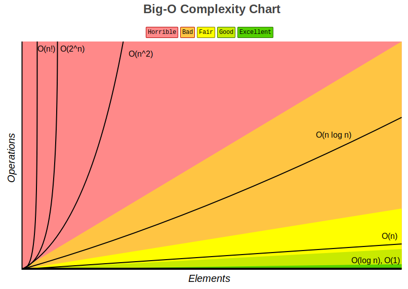

# Clases de complejidad algorítmica

Existen distintos tipos de complejidad algorítmica:

- **O(1) Constante:** no importa la cantidad de input que reciba, siempre demorara el **mismo tiempo**.
- **O(n) Lineal:** la complejidad crecerá de forma **proporcional** a medida que crezca el input.
- **O(log n) Logarítmica:** nuestra función crecerá de forma **logarítmica** con respecto al input. Esto significa que en un inicio crecerá rápido, pero luego se estabilizara.
- **O(n log n) Log lineal:** crecerá de forma **logarítmica** pero junto con una **constante**.
- **O(n²) Polinomial:** crecen de forma cuadrática. No son recomendables a menos que el input de datos en pequeño.
- **O(2^n) Exponencial:** crecerá de forma **exponencial**, por lo que la carga es muy alta. Para nada recomendable en ningún caso, solo para análisis conceptual.
- **O(n!) Factorial:** crece de forma **factorial**, por lo que al igual que el exponencial su carga es muy alta, por lo que jamas utilizar algoritmos de este tipo.

 
  

