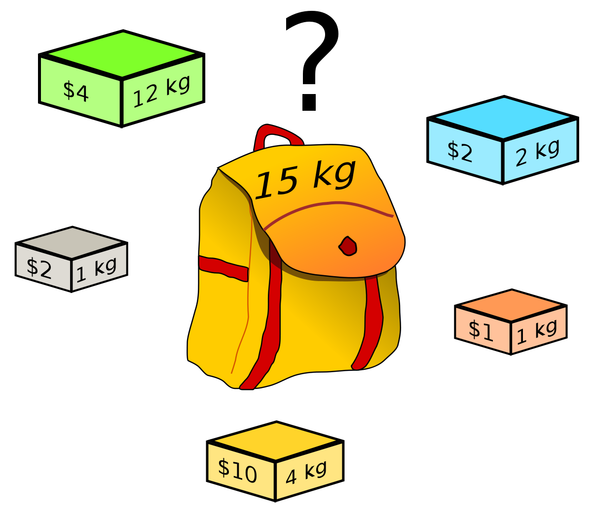

# El problema del morral

<div align="center"> 
  
</div>

Imagina que eres un ladrón que entra a un museo pero tienes un gran problema, nada mas tienes una mochila pero hay muchísimas cosas mas de las que puedes cargar, por lo cual debes determinar cuales artículos puedes cargar y te entregaran el mayor valor posible.

Para este problema sabemos que no podemos dividir los artículos, por lo que nuestra primera aproximación sera evaluar los artículos.

```py
def morral(tamano_morral, pesos, valores, n):

    if n == 0 or tamano_morral == 0:
        return 0

    if pesos[n - 1] > tamano_morral:
        return morral(tamano_morral, pesos, valores, n - 1)

    return max(valores[n - 1] + morral(tamano_morral - pesos[n - 1], pesos, valores, n - 1),
                morral(tamano_morral, pesos, valores, n - 1))


if __name__ == '__main__':
    valores = [60, 100, 120]
    pesos = [10, 20, 30]
    tamano_morral = 40
    n = len(valores)

    resultado = morral(tamano_morral, pesos, valores, n)
    print(resultado)
```
